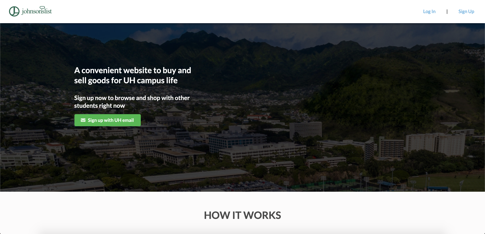
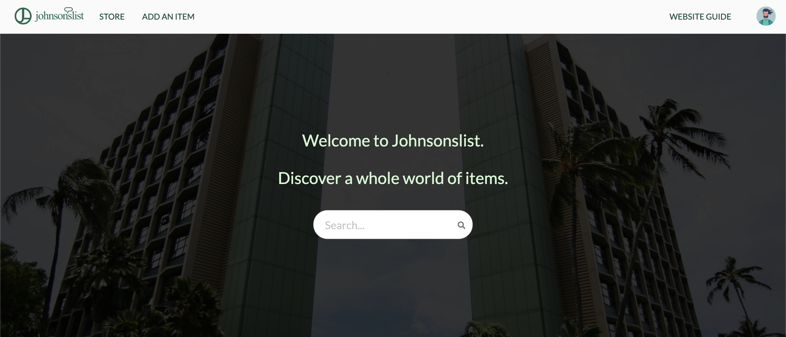
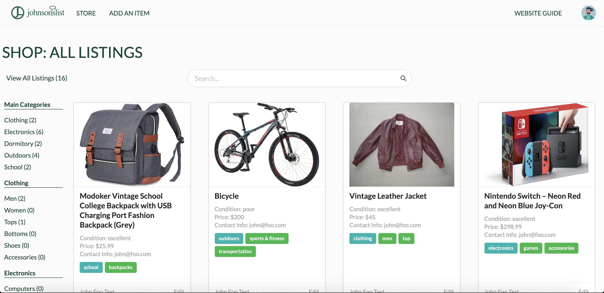
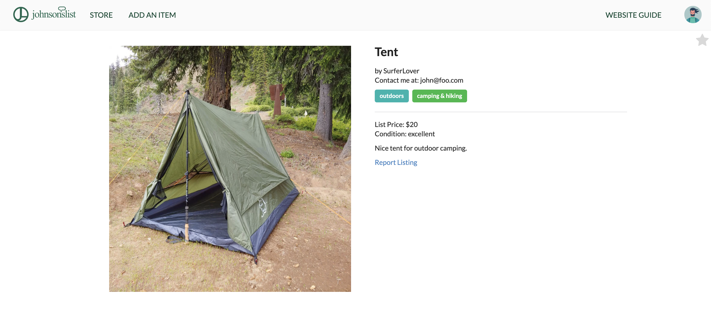

<h1>What Exactly is Johnsonslist?</h1>

Although the UH Community is compacted within an area that isn't too far apart, there isn't an easy method to view and sell one's own goods within the community. That's where Johnsonslist comes along and helps. Johnsonslist is an intuitive, modern take on a forum where UH community members can create listings and advertise their items for sale. With the concept heavily inspired by Craigslist, my team and I decided to create the web application from the ground up.

Johnsonslist's github repo can be found [here](https://github.com/Johnsonslist/Johnsonslist), along with the project homepage [here](https://johnsonslist.github.io).

<h1>Brief Rundown of Johnsonslist</h1>

Once the user registers and logs in, they're redirected to a home page where they're able to search for an item right away that redirects them to the store automatically. With no hassle, the user can experience the website and the store!

Within the store page, the user can see right away how many listings are made and click between each category on the sidebar if they so choose to only view a specific set of items. This allows for easy access to locate whatever is needed.

From there, If the user clicks a listing, it will redirect them to a page where it displays the image clearly with a description of the listing, contact information of the owner, the price, and said category that it belongs to. Then all that's left to do is contact the owner, or star it in the top right hand corner to save and keep watch.

<h1>My Development from Johnsonslist</h1>

Throughout the project, I found myself working in both front end and back end frequently. I was the brains behind the interface and design for most pages, while also trying to make sure it ran smoothly. I filtered through a lot of websites to try and notice a pattern if any modern websites have a layout for their website. I eventually stumbled upon a select few and grew inspiration from them. 

This project has helped me grow exponentially as a developer and as a teammate. I didn't realize how hard it would to work with a team and properly communicate everything that was going on. Since we had to build from scratch, we had to make sure we were all working towards the same end goal or else there would be consistent errors with everything we do. Along side the issue driven development style done with the project, learning to balance between front end and back end was invaluable experience.